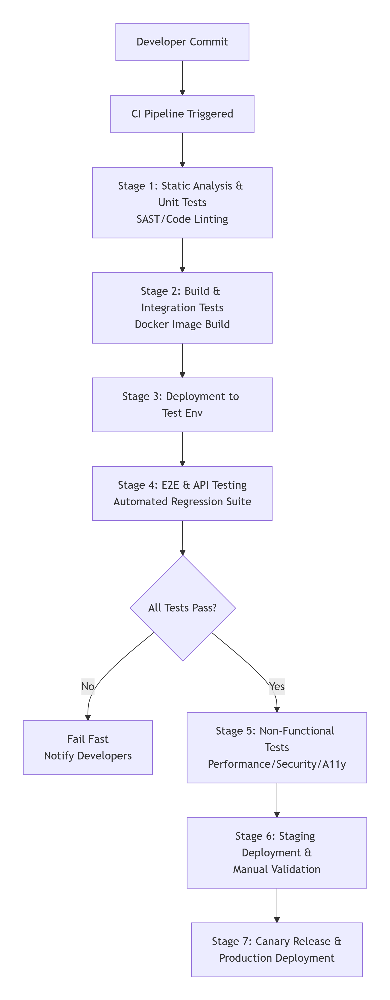

# Comprehensive Test Strategy for AI-Powered Medical Application

## 1. Executive Summary

### What is the Executive Summary?
The Executive Summary is a high-level overview that gives readers a quick understanding of the entire testing strategy without going into technical details.

### Why is it important?
- **For Executives**: Provides quick understanding of testing approach
- **For New Team Members**: Onboarding document to understand testing philosophy
- **For Stakeholders**: Sets expectations about quality standards and approach
- **For Regulatory Bodies**: Shows comprehensive testing mindset from the start

### Key Points Explained:
- **AI-Powered Medical Application**: We're testing software that uses artificial intelligence to help with medical case processing
- **Patient Safety Focus**: Medical software has zero tolerance for errors that could harm patients
- **Multi-Layered Approach**: We use different types of testing at different stages
- **Continuous Integration**: Testing happens automatically throughout development

## 2. Quality Objectives & Principles

### 2.1 Core Principles

#### Patient Safety First
**What it means**: Every testing decision considers potential impact on patient health

**Practical Examples**:
- Testing AI diagnosis recommendations against known medical cases
- Validating that patient data can't be corrupted or lost
- Ensuring the system never suggests wrong medications or treatments

**Why it matters**: A single software bug could lead to misdiagnosis, wrong treatment, or patient harm

#### Defense in Depth
**What it means**: Using multiple layers of testing protection

**The Layers**:
1. **Unit Tests** - Catch coding errors in individual components
2. **Integration Tests** - Find problems when components work together
3. **E2E Tests** - Validate complete medical workflows
4. **Security Tests** - Protect sensitive patient data

**Why it matters**: Complex medical software needs multiple safety nets - no single test type can catch all problems

#### Regulatory Compliance
**What it means**: Testing to meet legal and medical standards

**Key Standards**:
- **HIPAA** - US law for patient data privacy and security
- **GDPR** - European data protection regulations
- **IEC 62304** - International standard for medical device software

**Why it matters**: Non-compliance can lead to legal penalties, fines, and loss of medical licenses

#### Shift-Left Mentality
**What it means**: Testing early in the development process

**How it works**:
- Developers write tests while writing code
- AI models are tested during development, not just at the end
- Problems are found when they're cheapest to fix

**Why it matters**: Fixing bugs early is 100x cheaper than fixing them after release

#### Automation-First
**What it means**: Preferring automated tests over manual testing where possible

**The Balance**:
- **80% Automated**: Repetitive checks, regression tests, basic workflows
- **20% Manual**: Complex medical judgment, exploratory testing, UX validation

**Why it matters**: Automated tests are faster, more consistent, and can run continuously

### 2.2 Quality Metrics

| Metric | Target | Why It Matters | How We Measure |
|--------|---------|----------------|----------------|
| **AI Model Accuracy** | >95% | Ensures AI is reliable for medical use | Compare against verified medical cases |
| **Test Automation Coverage** | >90% | Enables fast, continuous testing | (Automated tests ÷ Total tests) × 100 |
| **Defect Escape Rate** | <1% | Measures testing effectiveness | (Production bugs ÷ Total bugs) × 100 |
| **Critical Bug Resolution** | <24 hours | Patient safety can't wait | Time from bug report to deployed fix |

## 3. Test Pyramid Strategy

### 3.1 Unit Testing (Foundation Layer)

#### Purpose
Testing the smallest pieces of code in isolation to ensure they work correctly

#### What We Test
- **Angular Components**: Verify UI elements display data correctly
- **AI Algorithms**: Test medical calculation logic
- **Services**: Business logic for patient data processing
- **Utility Functions**: Data transformation and formatting

#### Tools & Process
- **Jasmine/Karma**: Testing frameworks for Angular applications
- **Pre-commit Hooks**: Tests run automatically before code is committed
- **Fast Execution**: Complete suite runs in minutes, not hours
- **High Coverage**: 80%+ of code must have automated tests

#### Example Test Code
```typescript
// Test that risk calculation works for different medical scenarios
it('should calculate high risk for elderly patients with multiple conditions', () => {
  const patient = { age: 75, conditions: ['diabetes', 'hypertension'] };
  const riskScore = calculatePatientRisk(patient);
  expect(riskScore).toBe('HIGH');
});hould calculate high risk for elderly patients with multiple conditions', () => {
  const patient = { age: 75, conditions: ['diabetes', 'hypertension'] };
  const riskScore = calculatePatientRisk(patient);
  expect(riskScore).toBe('HIGH');
});
```
## 3.2 Integration Testing

### Purpose
Verify that different parts of the system work together correctly

### What We Test
- **Frontend-Backend Communication**: Angular app talking to medical APIs
- **AI Service Integration**: AI models working with patient data systems
- **Database Operations**: Storing and retrieving medical records
- **Microservice Coordination**: Multiple services working together

### Tools & Process
- **Supertest**: Testing API endpoints and responses
- **Postman/Newman**: Automated API contract testing
- **Test Environment**: Dedicated environment with medical test data
- **Data Flow Validation**: Ensuring patient data moves correctly between systems

### Example Test Code
```javascript
// Test complete patient case processing flow
test('should process patient case end-to-end', async () => {
  const uploadResponse = await uploadPatientImages(medicalImages);
  const analysisResponse = await analyzeCase(uploadResponse.caseId);
  expect(analysisResponse.diagnosisSuggestions).toBeValidMedicalRecommendations();
});
```

## 3.3 End-to-End Testing

### Purpose
Test complete medical workflows from start to finish, simulating real doctor usage

### Critical Medical Journeys

#### Journey 1: Patient Case Processing
1. Doctor uploads medical images (X-rays, MRI scans)
2. AI analyzes images and suggests possible diagnoses
3. Doctor reviews AI suggestions and provides feedback
4. System documents the complete case history
5. Data is stored securely for future reference

#### Journey 2: Multilingual Medical Workflows
- Test system in all supported languages (English, Spanish, French, etc.)
- Verify medical terminology is correctly translated
- Ensure right-to-left languages (Arabic, Hebrew) display properly
- Validate that language preferences don't affect medical accuracy

#### Journey 3: Emergency Case Handling
- Test priority handling of urgent cases
- Verify emergency access protocols work
- Ensure critical alerts are delivered immediately
- Validate system performance under emergency load

### Tools
- **Playwright**: Modern tool for automated browser testing
- **Real User Simulation**: Tests mimic actual doctor behavior
- **Cross-Browser Testing**: Works on Chrome, Firefox, Safari, Edge
- **Mobile Testing**: Verify doctors can use the system on tablets and phones

## 3.4 Specialized Testing

### Performance Testing
**What**: Testing system behavior under heavy load

**Medical Context**:
- Multiple doctors using system simultaneously during peak hours
- AI processing large medical images (high-resolution MRI scans)
- Emergency situations with many concurrent users
- Long-running medical analysis operations

**Tools**: JMeter for simulating heavy user loads

**Metrics**: Response times, system stability, resource usage

### Security Testing
**What**: Protecting patient health information (PHI)

**Critical Areas**:
- **Unauthorized Access**: Preventing non-medical staff from viewing patient records
- **Data Encryption**: Ensuring patient data is encrypted during transmission and storage
- **User Authentication**: Secure login systems for medical staff
- **Audit Trails**: Tracking who accessed which patient records and when

**Tools**:
- **SonarQube**: Static code analysis for security vulnerabilities
- **OWASP ZAP**: Active security scanning for web applications

### Accessibility Testing
**What**: Ensuring usability for people with disabilities

**Medical Importance**:
- Doctors with visual impairments using screen readers
- Aging medical staff who need larger text and high contrast
- Legal requirements for medical software accessibility
- Emergency situations where any staff member must be able to use the system

**Tools**:
- **axe-core**: Automated accessibility testing
- **Lighthouse**: Comprehensive web app quality testing
- **Manual Testing**: Real users with disabilities testing the system

## 4. CI/CD Pipeline Approach

### 4.1 Complete Pipeline Architecture



## 4.2 Detailed Stage Explanations

### Stage 1: Pre-merge Validation
**When it runs**: When a developer creates a Pull Request

**What it does**:
- **ESLint**: Checks code style and patterns
- **SonarQube**: Static security analysis
- **Unit Tests**: Fast test suite runs in under 5 minutes
- **Build Verification**: Ensures code compiles correctly

**Why it matters**: Catches problems before they affect the main codebase

### Stage 2: Build & Package
**When it runs**: After code is merged to main branch

**What it does**:
- **Docker Image Creation**: Packages application into containers
- **Angular Production Build**: Optimizes frontend for performance
- **Dependency Scanning**: Checks for vulnerable third-party libraries
- **Container Security**: Scans Docker images for security issues

**Output**: Versioned, secure Docker images ready for deployment

### Stage 3: Integration Testing
**Environment**: Dedicated test environment with medical test data

**What it tests**:
- **API Endpoints**: All 500+ API tests must pass
- **AI Model Ground Truth**: New AI models compared against verified medical cases
- **Database Operations**: Data migrations and queries work correctly
- **Service Communication**: All microservices can talk to each other

**Duration**: 15-20 minutes for complete test suite

### Stage 4: E2E Testing
**Environment**: Staging environment that mimics production

**What it tests**:
- **Critical User Journeys**: 10+ essential medical workflows
- **Multilingual Scenarios**: System behavior in different languages
- **Cross-Browser Compatibility**: Chrome, Firefox, Safari, Edge
- **Mobile Responsiveness**: Tablets and mobile devices

**Tools**: Playwright for reliable browser automation

### Stage 5: Security & Performance
**Runs in Parallel** to save time:

**Security Testing**:
- **OWASP ZAP**: Active penetration testing
- **Vulnerability Scanning**: Known security issues
- **Compliance Check**: HIPAA and GDPR requirements

**Performance Testing**:
- **Load Testing**: 100+ concurrent medical users
- **Stress Testing**: System behavior at maximum capacity
- **Endurance Testing**: Long-running operation stability

**Accessibility Testing**:
- **WCAG 2.1 AA**: Compliance with accessibility standards
- **Screen Reader Testing**: Compatibility with assistive technologies

## 6. Roles & Responsibilities

### 6.1 Development Team Roles

#### Software Developers
**Primary Responsibilities**:
- Write and maintain unit tests for all code changes
- Implement test-driven development (TDD) practices
- Fix bugs identified during testing phases
- Ensure code is testable and maintainable
- Participate in code reviews with testing focus

**Medical Context**: Must understand how code changes impact patient safety and data integrity

#### Frontend Angular Developers
**Specific Duties**:
- Test Angular components, services, and pipes
- Validate UI/UX implementations against medical workflow requirements
- Ensure responsive design works across medical devices and tablets
- Test multilingual support and accessibility features

#### Backend API Developers
**Specific Duties**:
- Develop and test RESTful APIs for medical data exchange
- Implement and test AI model integration endpoints
- Ensure data validation and error handling for medical data
- Test database operations and data persistence

### 6.2 Quality Assurance Team Roles

#### Manual Testers
**Primary Responsibilities**:
- Execute exploratory testing of new features
- Validate medical workflows from end-user perspective
- Test edge cases and complex medical scenarios
- Verify multilingual content and medical terminology
- Perform usability testing with medical staff

**Key Activities**:
- Create and execute manual test cases
- Report defects with detailed reproduction steps
- Validate fixes and perform regression testing
- Participate in user acceptance testing (UAT)

#### Automation Test Engineers
**Primary Responsibilities**:
- Develop and maintain test automation frameworks
- Create automated test scripts for regression testing
- Implement continuous testing in CI/CD pipeline
- Optimize test execution speed and reliability
- Generate test reports and metrics

**Technical Focus**:
- E2E test automation using Playwright/Cypress
- API automation testing with Supertest/Postman
- Performance test scripting with JMeter
- Security test automation integration

### 6.3 AI/ML Specialist Roles

#### AI Model Testers
**Primary Responsibilities**:
- Validate AI model accuracy against ground truth datasets
- Test model performance across different patient demographics
- Identify and report model bias or fairness issues
- Verify model integration with clinical workflows

**Specific Activities**:
- Execute shadow mode testing for new models
- Monitor model drift and performance degradation
- Validate model outputs against medical expert opinions
- Test model robustness with edge case medical data

#### Data Scientists (Testing Focus)
**Responsibilities**:
- Create synthetic medical data for testing
- Develop validation datasets for AI models
- Implement data quality checks and validation
- Test data preprocessing and feature engineering pipelines

### 6.4 Medical Domain Experts

#### Clinical Validators
**Primary Responsibilities**:
- Review and approve test cases for medical accuracy
- Validate AI model suggestions and diagnoses
- Test system usability from medical professional perspective
- Ensure medical terminology and workflows are correct

**Specific Activities**:
- Participate in user acceptance testing (UAT)
- Provide feedback on clinical workflow efficiency
- Validate emergency and critical care scenarios
- Approve medical content and decision support features

#### Medical Directors
**Oversight Responsibilities**:
- Final approval for production releases
- Sign-off on clinical safety and efficacy
- Ensure regulatory compliance in testing processes
- Review and approve incident response procedures

### 6.5 DevOps & Infrastructure Roles

#### DevOps Engineers
**Primary Responsibilities**:
- Maintain and optimize CI/CD pipeline infrastructure
- Manage test environments and deployment processes
- Implement monitoring and alerting for test execution
- Ensure test data management and security

**Specific Duties**:
- Configure automated testing in deployment pipelines
- Manage test environment provisioning and cleanup
- Implement test result reporting and dashboards
- Ensure HIPAA compliance in test environments

#### Infrastructure Specialists
**Responsibilities**:
- Maintain testing hardware and cloud resources
- Manage database environments for testing
- Ensure network connectivity for distributed testing
- Implement backup and recovery procedures for test data

### 6.6 Security & Compliance Roles

#### Security Testers
**Primary Responsibilities**:
- Conduct penetration testing and vulnerability assessments
- Test PHI (Protected Health Information) protection measures
- Validate authentication and authorization mechanisms
- Ensure data encryption and security controls

**Activities**:
- Execute security test cases and scenarios
- Perform static and dynamic security analysis
- Test compliance with HIPAA security requirements
- Validate audit trail and access logging

#### Compliance Officers
**Oversight Responsibilities**:
- Ensure testing processes meet regulatory requirements
- Review and approve test documentation for audits
- Validate data privacy and protection measures
- Monitor compliance with medical device regulations

### 6.7 Project & Product Management Roles

#### QA Manager
**Leadership Responsibilities**:
- Develop and maintain overall test strategy
- Allocate testing resources and manage team workload
- Define quality metrics and reporting standards
- Coordinate testing activities across teams

#### Product Owners (Medical Domain)
**Responsibilities**:
- Define acceptance criteria for medical features
- Prioritize testing based on clinical impact and risk
- Participate in UAT and feature validation
- Ensure product meets clinical needs and requirements

### 6.8 Cross-Functional Collaboration

#### Test Coordination Team
**Members**: Representatives from each role above

**Responsibilities**:
- Coordinate testing activities across different phases
- Resolve cross-functional testing dependencies
- Ensure comprehensive test coverage
- Facilitate communication between technical and medical teams

#### Incident Response Team
**Composition**: Developers, Testers, Medical Experts, DevOps

**Responsibilities**:
- Respond to critical issues found in production
- Execute emergency testing and validation
- Manage hotfix deployments and verification
- Conduct post-incident analysis and process improvement

### 6.9 Responsibility Matrix

| Phase | Primary Role | Supporting Roles |
|-------|-------------|------------------|
| **Unit Testing** | Developers | Automation Engineers |
| **Integration Testing** | Automation Engineers | Developers, DevOps |
| **E2E Testing** | Manual Testers | Automation Engineers, Medical Experts |
| **AI Model Testing** | AI Testers | Data Scientists, Medical Experts |
| **Security Testing** | Security Testers | DevOps, Developers |
| **Performance Testing** | Automation Engineers | DevOps, Developers |
| **UAT** | Medical Experts | Manual Testers, Product Owners |
| **Production Deployment** | DevOps | All Teams |
| **Post-Release Monitoring** | DevOps | Developers, Testers |

### 6.10 Skill Requirements

#### Technical Skills
- **Test Automation**: Playwright, Selenium, API testing tools
- **Programming**: JavaScript/TypeScript, Python for test scripting
- **CI/CD**: GitHub Actions, Jenkins, pipeline configuration
- **Database**: SQL, data validation, test data management

#### Domain Skills
- **Medical Knowledge**: Understanding of healthcare workflows
- **Regulatory Awareness**: HIPAA, GDPR, medical device regulations
- **Clinical Processes**: Patient data handling, diagnosis workflows
- **Risk Management**: Identifying and mitigating clinical risks

#### Soft Skills
- **Communication**: Bridging technical and medical terminology
- **Collaboration**: Working across multidisciplinary teams
- **Attention to Detail**: Critical for patient safety requirements
- **Problem-Solving**: Troubleshooting complex integrated systems
### Stage 6: Staging Deployment
**Manual Approval Required**:
- **Medical Expert Validation**: Real doctors test new features
- **UAT (User Acceptance Testing)**: Hospital staff verify workflows
- **Business Process Validation**: End-to-end medical scenarios
- **Compliance Sign-off**: Legal and regulatory approval

**Gatekeepers**: Medical Director and QA Lead must approve

### Stage 7: Production Release
**Safe Deployment Strategy**:

**Canary Release Process**:
1. **5% Canary**: Deploy to small user group (1-2 hospitals)
2. **24-Hour Monitoring**: Watch for any issues
3. **50% Expansion**: If successful, deploy to half of users
4. **Full Rollout**: Complete deployment after 48 hours success

**Rollback Capability**: Automated rollback within 5 minutes if problems detected

### Stage 8: Post-Deployment Monitoring
**Continuous Monitoring**:
- **Application Performance**: Response times and error rates
- **AI Model Accuracy**: Real-time performance tracking
- **User Behavior Analytics**: Usage patterns and workflow efficiency
- **System Health**: Resource utilization and availability

**Alerting**:
- **Critical Alerts**: Immediate notification for system failures
- **Performance Alerts**: Degradation in response times
- **Accuracy Alerts**: AI model performance drops
- **Security Alerts**: Suspicious activities detected

### Stage 9: Feedback Loop Integration
**Data Collection**:
- **User Feedback**: Doctor and staff input on system usability
- **Performance Data**: System metrics and bottleneck identification
- **Accuracy Reports**: AI model performance in real-world scenarios
- **Bug Reports**: Production issues and user-reported problems

**Process Improvement**:
- **Weekly Reviews**: Team analysis of pipeline performance
- **Monthly Retrospectives**: Process improvement identification
- **Quarterly Strategy Updates**: Testing approach refinement
- **Continuous Learning**: Incorporating lessons into future cycles

### Stage 10: Compliance & Audit Reporting
**Documentation**:
- **Test Evidence**: Automated collection of test results
- **Security Scans**: Vulnerability assessment reports
- **Performance Metrics**: Load testing results and analysis
- **Compliance Reports**: HIPAA and regulatory requirement verification

**Audit Trail**:
- **Change Logs**: Complete history of all deployments
- **Approval Records**: Sign-off documentation from medical experts
- **Incident Reports**: Production issues and resolutions
- **Performance Baselines**: Historical data for trend analysis